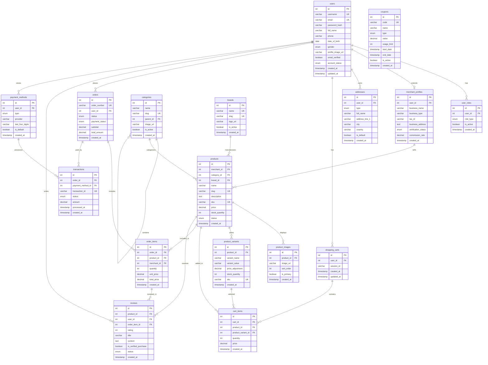

# Amazon-like E-commerce Platform

A comprehensive database design and system architecture for building a scalable e-commerce platform similar to Amazon.

## Table of Contents
- [Overview](#overview)
- [Features](#features)
- [Database Schema](#database-schema)
- [Entity Relationship Diagram](#entity-relationship-diagram)
- [System Architecture](#system-architecture)
- [User Workflows](#user-workflows)
- [Installation & Setup](#installation--setup)
- [API Documentation](#api-documentation)
- [Contributing](#contributing)

## Overview

This project provides a complete blueprint for building an Amazon-like e-commerce platform with support for multiple user types (customers, merchants, admins), comprehensive product management, order processing, payment integration, and advanced features like reviews, promotions, and analytics.

## Features

### Core Functionality
- ✅ **Multi-User System**: Customers, Merchants, and Admins with role-based permissions
- ✅ **Product Management**: Categories, brands, variants, inventory tracking
- ✅ **Shopping Cart & Wishlist**: Persistent cart, multiple wishlists
- ✅ **Order Management**: Complete order lifecycle from cart to delivery
- ✅ **Payment Processing**: Multiple payment methods, transaction tracking
- ✅ **Shipping Integration**: Multiple carriers, tracking, delivery confirmation
- ✅ **Review System**: Product reviews with verification and moderation
- ✅ **Promotion Engine**: Coupons, discounts, promotional campaigns
- ✅ **Search & Analytics**: Product search, user behavior tracking
- ✅ **Notification System**: Email, SMS, in-app notifications


## Database Schema

### User Management Tables
- `users` - Core user information
- `user_roles` - Role assignment (customer/merchant/admin)
- `merchant_profiles` - Extended merchant information
- `addresses` - User addresses for shipping/billing

### Product Catalog
- `categories` - Hierarchical product categories
- `brands` - Product brands
- `products` - Main product information
- `product_images` - Product photos and media
- `product_attributes` - Custom product attributes
- `product_variants` - Size, color, and other variations

### Shopping & Orders
- `shopping_carts` - User shopping carts
- `cart_items` - Items in shopping carts
- `wishlists` - User wishlists
- `wishlist_items` - Items in wishlists
- `orders` - Order information
- `order_items` - Individual items in orders
- `order_addresses` - Shipping and billing addresses per order

### Payment & Transactions
- `payment_methods` - Stored payment methods
- `transactions` - Payment transaction records
- `coupons` - Promotional codes
- `coupon_usage` - Coupon redemption tracking

### Shipping & Fulfillment
- `shipping_methods` - Available shipping options
- `shipments` - Shipment tracking information

### Reviews & Ratings
- `reviews` - Product reviews and ratings
- `review_images` - Review photos

### System & Analytics
- `notifications` - User notifications
- `search_terms` - Search analytics
- `product_views` - Product view tracking
- `settings` - System configuration

## Entity Relationship Diagram



## System Architecture

### User Types & Privileges

#### Customer/User
- Browse and search products
- Manage shopping cart and wishlist
- Place and track orders
- Write product reviews
- Manage account and addresses
- View order history and invoices

#### Merchant
- Manage product catalog
- Process and fulfill orders
- View sales analytics and reports
- Handle customer inquiries
- Create promotional campaigns
- Manage inventory and pricing

#### Admin
- Full system control and monitoring
- User account management (suspend/activate)
- Content moderation (products, reviews)
- System configuration and settings
- Financial reporting and analytics
- Merchant verification and onboarding

## User Workflows

### Customer Purchase Flow
```
Homepage → Browse/Search → Product Details → Add to Cart → 
Checkout → Payment → Order Confirmation → Shipping → 
Delivery → Review Product
```

### Merchant Order Flow
```
New Order Notification → Order Review → Inventory Check → 
Order Confirmation → Pick & Pack → Ship Order → 
Update Tracking → Order Complete
```

### Admin Management Flow
```
Dashboard → Monitor Activities → Handle Support Tickets → 
Review Merchant Applications → Moderate Content → 
Generate Reports → System Maintenance
```
