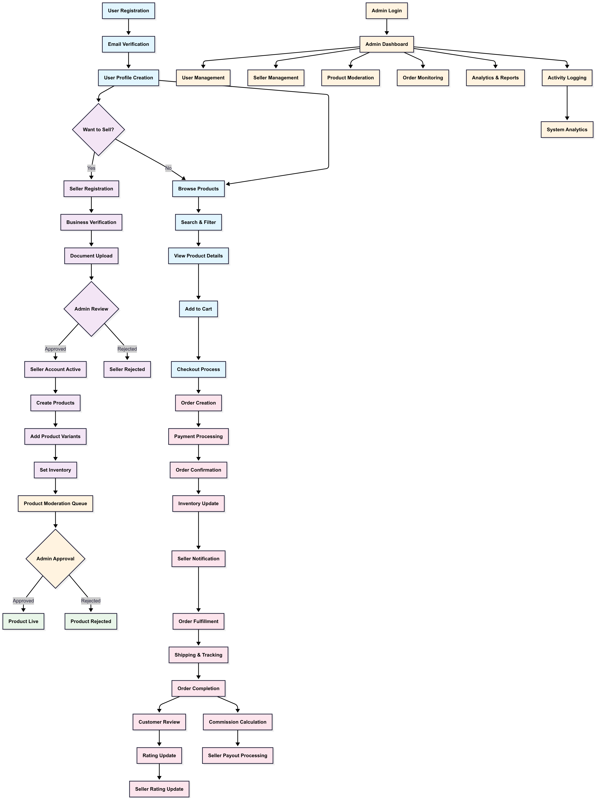

# Amazon-like E-commerce Platform

## System Architecture


### User Types & Privileges

#### Customer/User
- Browse and search products
- Manage shopping cart and wishlist
- Place and track orders
- Write product reviews
- Manage account and addresses
- View order history and invoices

#### Merchant
- Manage product catalog
- Process and fulfill orders
- View sales analytics and reports
- Handle customer inquiries
- Create promotional campaigns
- Manage inventory and pricing

#### Admin
- Full system control and monitoring
- User account management (suspend/activate)
- Content moderation (products, reviews)
- System configuration and settings
- Financial reporting and analytics
- Merchant verification and onboarding

## User Workflows

### Customer Purchase Flow
```
Homepage → Browse/Search → Product Details → Add to Cart → 
Checkout → Payment → Order Confirmation → Shipping → 
Delivery → Review Product
```

### Merchant Order Flow
```
New Order Notification → Order Review → Inventory Check → 
Order Confirmation → Pick & Pack → Ship Order → 
Update Tracking → Order Complete
```

### Admin Management Flow
```
Dashboard → Monitor Activities → Handle Support Tickets → 
Review Merchant Applications → Moderate Content → 
Generate Reports → System Maintenance
```
## System  flowchart

